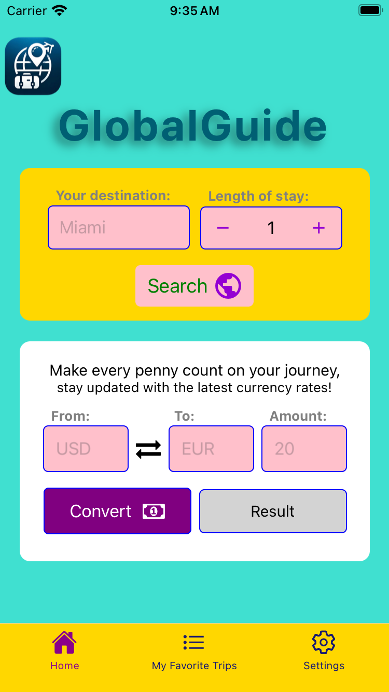
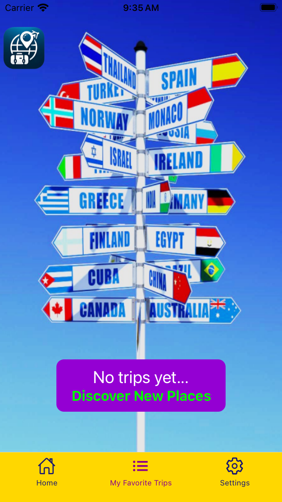
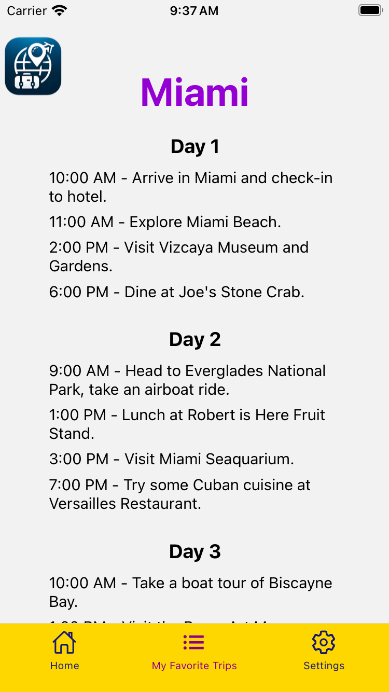
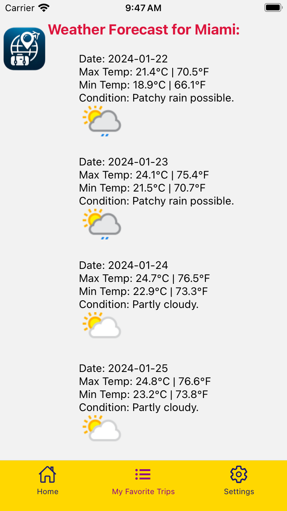

# GlobalGuide

#### Welcome to GlobalGuide, the ultimate travel companion app that transforms every journey into a seamless and personalized adventure! Imagine having a smart, intuitive assistant right in your pocket, ready to guide you through every city and country across the globe. Join GlobalGuide today and experience a world of travel like never before. It's not just about reaching your destination; it's about enjoying every step of the journey. Soonyou will be able to download the app on your smartphone and start your next adventure! 🌍 ✈️

## Wireframes

## Technologies used

- List of the technologies used for this app are:
    - React Native (Expo)
    - JavaScript
    - JSX
    - Apple O'Auth
    - Google O'Auth

## Getting Started

The app is expected to be launched to the App Store and Google Play Store by February 15th! Stay tuned!

## Planned future enhancements 

- Adding more functionality to the 'Settings' page
- Fixing Google O'Auth login issue
- Adding favorite trip option and saving the trip or deleting it
- Adding functionality so user can have many trips saved on one page
- Launching the app to App Store and Google Play Store

Shout out to [AI Trip Planner](https://rapidapi.com/nabeeldev1340/api/ai-trip-planner), [Weather API](https://www.weatherapi.com) and [Currency Converter](https://rapidapi.com/airaudoeduardo/api/currency-converter241/) for the API keys!